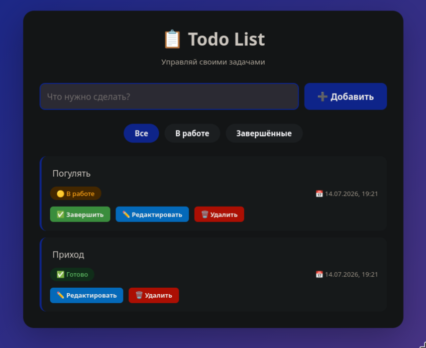

# Описание

Данная программа является fullstack приложением для управления заметками которая реализует базовый функционал REST API.



Для бэкэнда используется язык **Rust** а также СУБД **PostgreSQL**. Для миграции таблицы СУБД выпольняется запрос из файла **mirations.sql**. Сам код бэкэнда находится в папке **src**.

Для фронтенда используется классическая связка HTML, CSS, JavaScript. Код находится в папке **frontend**.

Для деплоя используется **Dockerfile**, чтобы собрать бэкэнд в Docker образ, а также **Docker Compose**, для объединения образа бэкэнда и образа **postgresql:alpine** из Docker Hub. Больше информации об этом находится в файлах **Dockerfile** и **docker-compose.yaml**.

# Инструкция по сборке

Для начала нужно создать файл .env внутри папки проекта и заполнить его следующим образом:
```
DATABASE_URL=postgres://<user>:<password>@localhost:5432/<your_db_name>

DB_NAME=<your_db_name>
DB_USER=<user>
DB_PASSWORD=<password>
```

Для сборки проекта в докере нужно прописать 
```bash
docker compose up --build
```

Либо скомпилировать напрямую через компилятор языка Rust, но тогда должен быть запущен локальный PostgreSQL с данными из .env
```
cargo build # Просто для сборки
cargo run # Для сборки и запуска
```

# Инструкция по использоанию

После запуска проекта, веб сервер бэкэнда будет доступен в браузере по адрессу **localhost:8080**. Но обычному пользователю будет достаточно открыть в браузере **frontend/index.html** файл фронтенда и протестировать функционал.